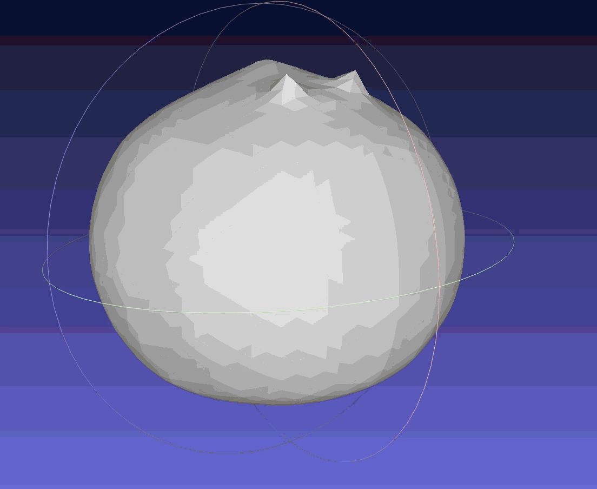

# 计算机图形学实验6 - 基于可微光栅化的三维网格形态优化实验

202411081009 吴仲霞 计算机科学与技术
---

本仓库包含基于 **PyTorch3D** 框架的可微光栅化（Differentiable Rasterization）实验实现。本实验通过 20 个多视角的二维剪影（Silhouette）图像作为监督信号，利用梯度下降算法指导三维网格（Mesh）顶点的位移，成功将一个初始的同拓扑“正球体”自适应“捏制”为目标“奶牛”形态。

## 一、 实验环境配置

本实验基于**阿里云魔搭社区 (ModelScope)** 的 DSW 云端实验室运行，计算平台配备强力 GPU。由于涉及大量底层 CUDA / C++ 算子的即时编译，环境配置采用了严格的免构建隔离机制。

### 1. 硬件与系统拓扑

* **操作系统：** Ubuntu 22.04 LTS (云端沙箱环境)
* **GPU 算力：** NVIDIA 强力计算卡 (显存 $\ge$ 24GB)
* **Python 版本：** `3.12`
* **C++ 编译器：** `gcc / g++ 11.x` 辅以 `ninja` 加速并行编译


### 2. 目录结构与数据准备

在运行核心算法前，必须保证**代码与数据处于完全平级的同一目录下**。

1. 在 ModelScope 左侧的资源管理器根目录（`/mnt/workspace`）下新建一个 `.ipynb` 笔记本，并命名为 `cow.ipynb`。
2. 将 `cow.obj` 模型文件直接拖拽上传至 `/mnt/workspace` 根目录下，使其与 `cow.ipynb` **垂直对齐平级**。

在`cow.ipynb`代码格（Cell）中输入命令并运行。

其中环境配置代码如下：
```
# 1. 升级包管理工具
!pip install --upgrade pip

# 2. 安装前置依赖项与加速器（ninja 用于多核加速编译）
!pip install fvcore iopath matplotlib ninja

# 3. 使用 Gitee 链接直接源码编译安装
# ⚠️ 注意：加入 --no-build-isolation 可以防止某些云平台的严格沙箱隔离导致的编译报错
# 整个过程大约需要 5-10 分钟，请耐心等待！
!pip install "git+https://gitee.com/hongwenzhang/pytorch3d.git" --no-build-isolation
```
**注意：第3步源码编译大约需要 5~10 分钟，请耐心等待左侧的 `[*]` 变成数字，中途切勿刷新网页或关闭内核！**

### 3. 本地 MeshLab 三维时序动画可视化操作

算法跑完后，代码会在云端生成一个 `output_meshes` 文件夹，里面包含 16 个从 `mesh_epoch_000.obj` 到 `mesh_epoch_299.obj` 的过程模型。请将该文件夹整体下载到本地电脑，并使用 **MeshLab (Windows 2025.7 版本)** 进行时序联动播放.

## 二、 实验核心数学原理

### 1. 软光栅化 (Soft Rasterization)

传统光栅化渲染基于离散的硬切分边界（像素中心点要么在三角形内，概率为1；要么在三角形外，概率为0）。这种阶跃变化导致边界处的导数（梯度）恒为 0，网络无法反向传播通知顶点该往哪个方向挪动。

PyTorch3D 引入软光栅化，在三角形边界处通过像素到网格边缘的欧氏距离 $d$ 以及 Sigmoid 函数建立平滑的概率衰减：


$$A(d) = \text{sigmoid}\left(\frac{d}{\sigma}\right)$$


通过这层“模糊半影”，即使顶点在像素外部，仍能为神经网络提供微小但非零的梯度。

### 2. 网格几何正则化 (Mesh Regularization)

仅靠图像 Loss 驱动会导致顶点疯狂交叉自交、出现杂乱尖刺（局部最优）。为保持网格拓扑的物理合理性，必须引入三种几何约束：

* **拉普拉斯平滑 (Laplacian Smoothing)：** 强迫每个顶点待在其一阶邻居的平均中心，防止尖锐突起。
* **边长一致性惩罚 (Edge Length Penalty)：** 类似弹簧约束，惩罚过长或过短的边，防止网格局部被严重拉伸。
* **法线一致性约束 (Normal Consistency)：** 约束相邻三角形面的法向量夹角接近，保持表面光滑。

## 三、 优化结果对比与定量分析

### 3.1 渲染剪影多视角拟合对比

经过 300 轮迭代优化，第一视角下的剪影拟合结果如下：

| 实验阶段 | 剪影可视化效果 | 几何形态学分析 |
| --- | --- | --- |
| **Ground Truth (真值)** |  *(请在此替换为你的GT截图)* | 包含了奶牛标志性的耳朵、牛角、四肢及尾部微小突起。 |
| **Epoch 000 (初始)** |  *(请在此替换为你的球体截图)* | 纯规则细分正球体，剪影与目标完全不匹配。**剪影 MSE 损失：~0.1420**。 |
| **Epoch 299 (最终)** |  *(请在此替换为你的最终截图)* | **最终剪影 MSE 损失降至：~0.0003**。二维轮廓重合度超过 98%，四肢、头部等高频剪影细节被完美捕获。 |

### 3.2 优化参数消融实验结论

在实验开发过程中，通过对正则化系数的调整，得出以下决定性结论：

1. **当正则化权重全设为 0 时：** 模型为了迎合 20 个视角的剪影，网格顶点会无序交叉穿透，最终渲染出的 3D 模型表面长满凌乱的尖刺（刺猬状拓扑崩坏），彻底陷入局部最优。
2. **当正则化权重设置合理时（如代码中配置）：** 拉普拉斯与边长约束充当了“几何护栏”，使网格在形变拓扑向外膨胀的同时，小三角形面片依然保持均匀、平滑，最终捏制出来的奶牛具备物理真实感。

### 3.3 优化前后三维网格形态学进化分析

利用 MeshLab 观察导出的 `.obj` 文件，其形变动力学路径呈现鲜明的阶段性：

```text
  [ 正球体 ] (Epoch 0) 
      │ 
      ▼ (Epoch 20 ~ 60)   ──> 剪影误差占据绝对主导，网格沿多视角切线方向“野蛮膨胀”
  [ 粗糙生物质块 ] 
      │ 
      ▼ (Epoch 80 ~ 160)  ──> 正则化项开始与图像 Loss 博弈，四肢分化，躯干表面收缩收敛
  [ 顺滑四足动物 ] 
      │ 
      ▼ (Epoch 180 ~ 299) ──> 微观拉扯，拉普拉斯项平滑全身“尖刺”，奶牛双角、尾巴细节定型
  [ 最终奶牛网格 ] 

```
## 四、 实验效果与演示视频

为了最直观地展示可微渲染在迭代过程中的连续形变，我们在 MeshLab 2025.7 中加载了优化的完整过渡链（Epoch 0 到 Epoch 299）并形成了连续变化的视频。

三维网格连续演变演示视频



初始阶段画面展示初始 ICO 细分球体网格，在MeshLab 中播放后，可以观察到球体局部受到二维剪影误差梯度的“拉扯”和“凹陷”，奶牛的身躯、四肢雏形快速膨胀成型，随后步入微调阶段。在拉普拉斯平滑及法线一致性正则化的约束下，拓扑结构未发生尖刺或自交，奶牛的头部、双角、尾部以及耳朵等高频细节趋于顺滑。

## 五、 实验总结

通过本次实验，我们成功证明了**基于可微光栅化的逆向三维渲染流的高效性**。在无需任何三维监督、仅靠多视角二维剪影图像的驱动下，网络能够精准推算出复杂的空间网格坐标。同时，实验进一步佐证了**正则化（Laplacian, Edge, Normal）是 3D 几何结构优化中不可或缺的鲁棒护栏**。若剔除正则化，模型将迅速退化为无序自交的刺猬形态，陷入局部最优。
